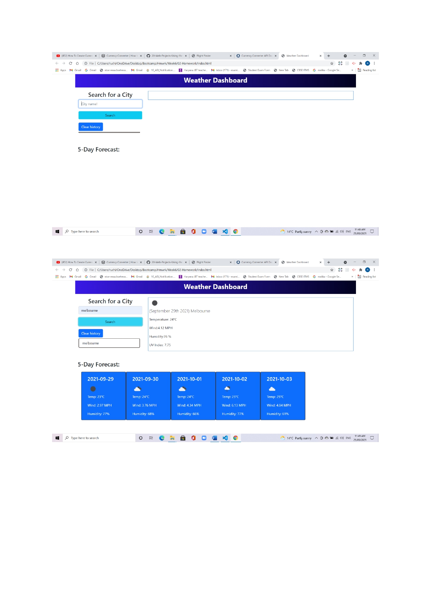
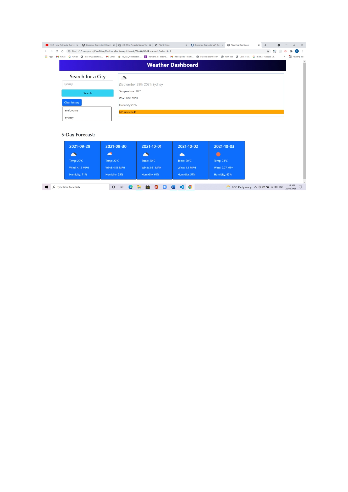

# Week6 Homework: Server-Side API: Weather Dashboard

# Brief Description about Homework:

* Weather-Dashboard is an application to find a weather condition of a given city both the current and 5-Days forecast at the same time.
The server-side API used to get response data object is retrieved from the Open weather API.
The current weather section is including the following weather characters and date.

- City, Date, Icon-image
- Temperature
- Wind Speed
- Humidity
- UV Index

* The 5-Days weather forecast also displays below the current weather conditions section and it includes the following information for each day.

- Date
- Icon image
- Temperature
- Humidity

* The local Storage is used here to store the previous search city and displays them to the user in the left side of the page under the list group. The user can also clear the search history by clicking the Clear History button.

# Completed Tasks
 
* When the user searches for a city, the user is presented with the current weather information.

* When the user view current weather conditions for that city, then  the user presented with the city name, the date, an icon representation of weather conditions, the temperature, the humidity, the wind speed, and the UV index.

* When the user view future weather conditions for that city, then the user presented with a 5-day forecast that displays the date, an icon representation of weather conditions, the temperature, the wind speed, and the humidity.

# Links

* [The URL of the GitHub repository](https://github.com/Ruchi479/Weather-Dashboard.git)

* [The URL of my deployed application]()

# Resources Used

* [Event Listeners MDN](https://developer.mozilla.org/en-US/docs/web/api/eventlistener)

* [Bootstrap Docs](https://getbootstrap.com/docs/4.1/getting-started/introduction/)

* [jQuery Docs](https://api.jquery.com/)

* [YouTube](https://www.youtube.com/)

* [Openweather API](https://openweathermap.org/api)

# Screenshots

